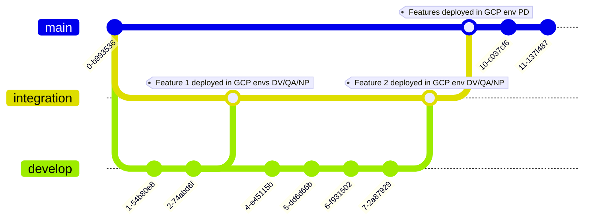

# Dataform sample project

This project is based on this [Dataform example project](https://docs.dataform.co/examples/projects/stackoverflow-bigquery).

It was adapted to work with the [Terraform Dataform module](https://github.com/devoteamgcloud/terraform-google-dataform-provider) and with CI/CD.

## Steps to deploy the project (To be repeated for all environments)

- [ ] Be sure to modify the `dataform.json` and the `config.yaml` files with your project details. Also modify the `iac/environments/<env>/main.tf` file.
- [ ] Comment the template module in `iac/environments/<env>/main.tf`, keep the init module uncommented
- [ ] Manually create a [CloudBuild](https://cloud.google.com/build/docs) trigger pointing to the GitHub repo on the `cloudbuild-init.yaml` file.
    - Set CloudBuild env variables :
        - _INIT: `true`
        - _APPLY_CHANGES: `true`
        - _ENV: `dv` OR `qa` OR `np` OR `pd`
- [ ] This project is based on a Terraform module which is stored here : https://github.com/devoteamgcloud/terraform-google-dataform-provider. In consequence, CloudBuild needs access to GitHub. This access is provided thanks to an SSH Key that is stored in Secret Manager. The secret has already been automatically created thanks to the previous step but is empty. You will need to fill it with your SSH Key.
    - [ ] Open your Cloud Shell and enter this commands. Replace github-email by your email.

    ```sh
    mkdir dataform-project-ssh-key
    cd dataform-project-ssh-key
    ssh-keygen -t rsa -b 4096 -N '' -f id_github -C <github-email>
    ```
    - [ ] Two files were created, `id_github` and `id_github.pub` (respectively private and public key).
    - [ ] Copy the content of the file id_github and paste it in the GCP Secret Mananer secret named `cloudbuild-ssh-key-<env>`.
    - [ ] Authorize the public SSH Key contained in the file id_github.pub in your GitHub account.
    - [ ] Don't forget to delete the folder `dataform-project-ssh-key` from your Cloud Shell for security reasons.
    - [ ] For more information about this steps, please refer to this [documentation](https://cloud.google.com/build/docs/access-github-from-build).
- [ ] The service account `deploy@[project-id].iam.gserviceaccount.com` (automatically created one step before) is the one that will deploy all the infrastructure. You have to give him some roles:
    - [ ] Editor
    - [ ] Secret Manager Secret Accessor
    - [ ] Cloud Build Service Agent
    - [ ] IAM Security Admin
- [ ] You can now uncomment the template module in `iac/environments/<env>/main.tf` and push the changes to GitHub. A Pull request from a develop branch to the integration branch will deploy changes to all the environments except prod (DV/QA/NP). A Pull request from the integration branch to the main branch will deploy changes to the production environment (PD).
- [ ] Finally, to use Dataform, you need to fill the secret 'dataform-github-token-[use-case]-dv' with a valid GitHub access token (Documentation [here](https://cloud.google.com/dataform/docs/connect-repository)).

## CI/CD Flow

develop -> integration -> main


